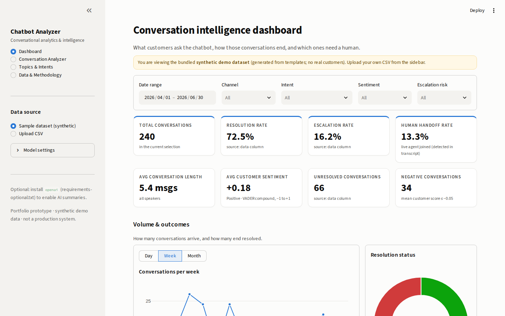
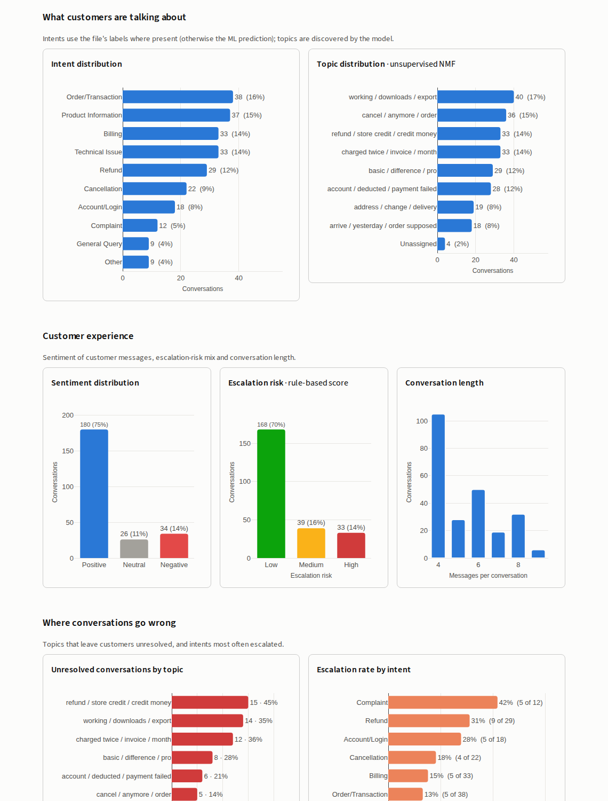
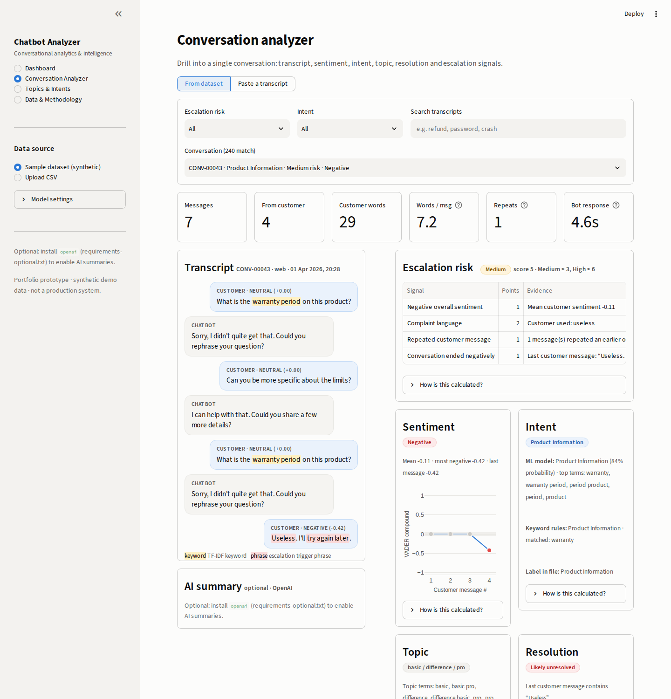
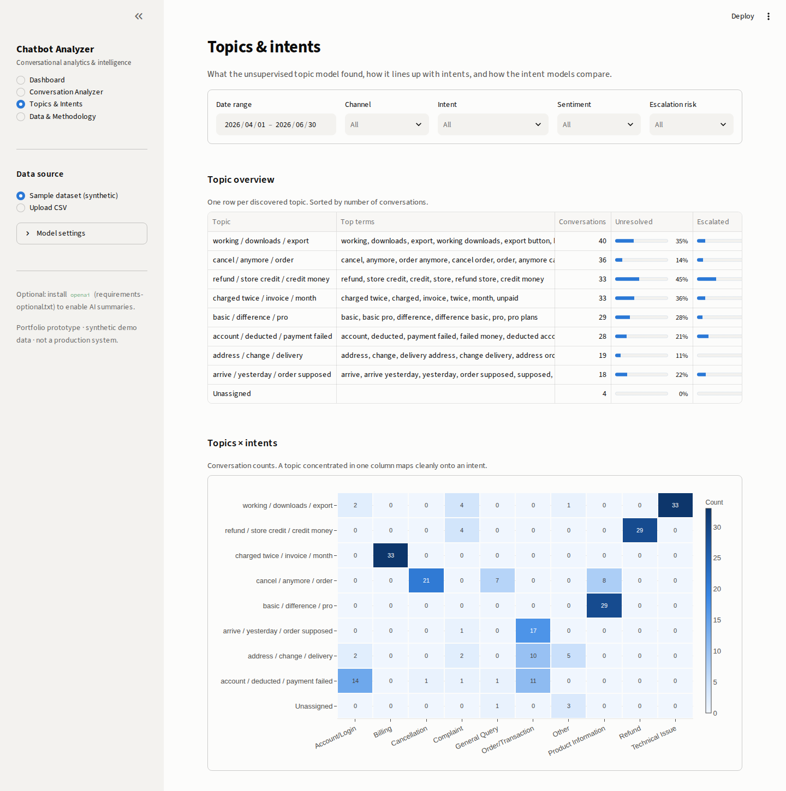
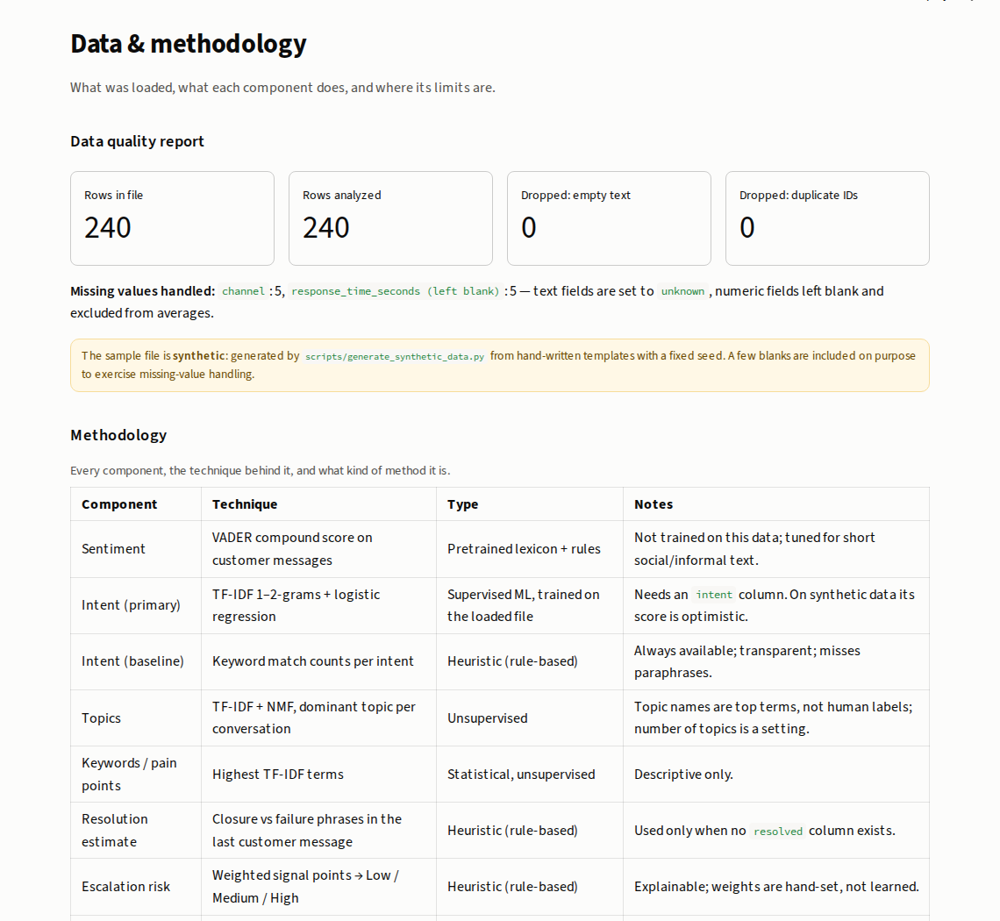
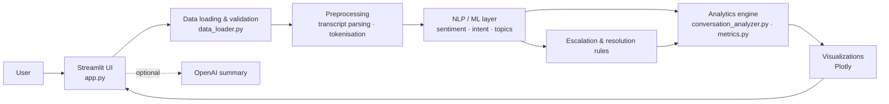

# Chatbot Analyzer — Conversational Analytics & Intelligence Platform

**Turns raw chatbot transcripts into an interactive dashboard that shows what customers ask about, which conversations fail, and which ones need a human — with every result explained.**


> **Portfolio prototype.** This project runs on a bundled **synthetic** dataset of 240 template-generated
> conversations. It is not deployed to production, has not been validated on real customer data, and
> makes no claims about real-world accuracy. See [Responsible AI & limitations](#responsible-ai--limitations).

---

## Problem statement

Support chatbots produce thousands of transcripts, but they are usually read only when something goes wrong.
Teams running a bot need answers to questions like:

- What are customers actually asking about, and which issues are most common?
- Which conversations were resolved, which were escalated, and which were quietly abandoned?
- Where is sentiment negative, and which topics leave customers stuck?
- Which conversations should a human look at *now*?

Reading transcripts by hand doesn't scale, and a single "resolution rate" number doesn't say *why* the bot fails.

## Solution

Chatbot Analyzer loads a CSV of conversations, parses each transcript into customer / bot / agent turns, and runs
an NLP layer over the customer's messages:

- **Sentiment** (pretrained VADER lexicon)
- **Intent** (a trained TF-IDF + logistic-regression classifier, next to an explainable keyword baseline)
- **Topics** (unsupervised TF-IDF + NMF)
- **Resolution, handoff and escalation risk** (transparent rules)

The results feed a KPI dashboard, a topic/intent explorer and a conversation-level drill-down. Each result carries
its evidence: the signals behind a risk score, the words behind an intent prediction, and the terms behind a topic.

## Key features

- **Dashboard:** 8 KPI cards (conversations, resolution, escalation, human-handoff rate, length, sentiment, unresolved, negative) and 10 interactive Plotly charts
- **Filters:** date range, channel, intent, sentiment and escalation risk, applied to every chart
- **Conversation Analyzer:** chat-style transcript with per-message sentiment, highlighted keywords and escalation-trigger phrases, plus intent, topic, resolution and risk panels, each with a *"How is this calculated?"* note
- **Paste-a-transcript mode:** analyse any conversation you type in
- **Review queue:** high-risk conversations ranked by score; click a row to open it
- **Topics & Intents:** topic overview, topic × intent heatmap, sentiment by intent, and a comparison of the ML model against the rule baseline
- **Data & Methodology:** data-quality report, method table, full escalation rules, CSV schema and export of the analysed data
- **Bring your own CSV:** only `conversation_id` and `conversation_text` are required; missing optional columns fall back to clearly labelled estimates
- **Optional AI summary:** OpenAI summary of a conversation, off by default; the app is fully functional without an API key

## Application screenshots

Captured from the running app on the bundled synthetic data. To replace them, drop new images into `docs/screenshots/` with the same file names.

| Dashboard | Charts |
|---|---|
|  |  |

| Conversation Analyzer | Topics & Intents |
|---|---|
|  |  |

| Data & Methodology |
|---|
|  |

## Architecture



The `src/` package has no Streamlit imports, so each component can be unit-tested and reused on its own.
Module-by-module details and design decisions: [`docs/architecture.md`](docs/architecture.md).

```
chatbot-analyzer/
├── app.py                        # Streamlit application (4 pages)
├── src/
│   ├── data_loader.py            # CSV loading, validation, missing-value handling
│   ├── preprocessing.py          # transcript parsing, normalisation, tokenisation
│   ├── sentiment.py              # VADER sentiment
│   ├── intent.py                 # keyword baseline + TF-IDF/logistic-regression model
│   ├── topic_model.py            # TF-IDF + NMF topics, keyword extraction
│   ├── escalation.py             # explainable escalation-risk score
│   ├── conversation_analyzer.py  # per-conversation analysis & dataset enrichment
│   ├── metrics.py                # KPIs and aggregations
│   ├── visualization.py          # Plotly chart builders
│   └── llm_summary.py            # optional OpenAI summary
├── data/
│   ├── sample_conversations.csv  # 240 synthetic conversations
│   └── README.md                 # data dictionary
├── scripts/generate_synthetic_data.py
├── tests/                        # pytest suite (incl. headless UI smoke tests)
├── docs/architecture.md
└── docs/screenshots/
```

## Tech stack

| Technology | Why it is used |
|---|---|
| **Python** | Core language for data processing and NLP |
| **Streamlit** | Fast, interactive web UI with caching and widgets, without a separate frontend |
| **pandas / NumPy** | Loading, cleaning and aggregating conversation data |
| **scikit-learn** | TF-IDF features, logistic-regression intent model, NMF topic model, evaluation metrics |
| **vaderSentiment** | Pretrained, lightweight sentiment model suited to short informal text; no downloads or GPU |
| **Plotly** | Interactive charts with hover tooltips |
| **pytest** | Unit tests plus Streamlit `AppTest` smoke tests for every page |
| **python-dotenv / openai** *(optional)* | Local configuration for the optional LLM summary |

## Example workflow

1. **CSV upload:** use the sample file or upload your own from the sidebar.
2. **Validation & preprocessing:** required columns are checked, types normalised, empty and duplicate rows dropped, missing values filled or flagged, and transcripts split into turns.
3. **NLP analysis:** sentiment per customer message, intent (ML + rules), topic assignment, keywords, resolution estimate, handoff detection and escalation score.
4. **Metrics:** KPIs and group-bys, using ground-truth columns when present and labelled estimates otherwise.
5. **Dashboard:** filter and explore the charts; the review queue lists the conversations with the highest risk scores.
6. **Drill-down:** open any conversation to see the transcript and the evidence behind each result.

## Analytics

| Metric | Definition |
|---|---|
| Resolution rate | Share of conversations with `resolved = true` (falls back to the heuristic estimate if the column is absent) |
| Escalation rate | Share with `escalated = true` (falls back to share of *High* risk) |
| Human handoff rate | Share where a human agent appears in the transcript or the bot announces a transfer |
| Avg conversation length | Mean number of messages, all speakers |
| Avg customer sentiment | Mean VADER compound score of customer messages (−1 to +1) |
| Unresolved conversations | Count not resolved |
| Negative conversations | Count with mean customer sentiment ≤ −0.05 |
| Unresolved by topic / escalation by intent | Counts and rates per group, showing *where* the bot struggles |
| Top customer issues | Highest-weighted TF-IDF terms across unresolved or negative conversations (descriptive, not causal) |

## Machine learning / NLP

What is implemented, and what kind of method each component is:

| Component | Technique | Type |
|---|---|---|
| Sentiment | VADER compound score, customer messages only; ±0.05 thresholds | **Pretrained** lexicon + rules; not trained on this data |
| Intent (primary) | TF-IDF (1–2-grams) → multinomial logistic regression; stratified hold-out evaluation; per-prediction term contributions | **Supervised ML**, trained at start-up on the `intent` labels in the loaded CSV (the bundled data is synthetic) |
| Intent (baseline) | Keyword match counts per intent | **Heuristic** |
| Topics | TF-IDF → NMF; dominant topic per conversation; topics named by top terms | **Unsupervised** |
| Keywords & pain points | Highest TF-IDF terms per conversation / per problem subset | Statistical, unsupervised |
| Resolution estimate | Closure vs failure phrases in the last customer message | **Heuristic** (used only without a `resolved` column) |
| Escalation risk | Weighted signals → Low / Medium / High | **Heuristic**, fully explainable |
| Human handoff | Agent turn or bot transfer message | **Heuristic** |

**About the intent model score.** The app reports the ML model's hold-out accuracy on the loaded file. On the bundled
synthetic data it is near-perfect. That is expected, because the conversations come from a small set of templates;
it is a sanity check that the pipeline works, **not** evidence of real-world accuracy.

**Why NMF for topics?** On short support messages, K-Means on TF-IDF vectors put most conversations into one
catch-all cluster; NMF produced balanced, readable topics. The number of topics is adjustable in the sidebar.

### Escalation risk signals

| Signal | Points |
|---|---|
| Explicit request for a human ("real person", "live agent", …) | 3 |
| Strongly negative message (VADER ≤ −0.5) | 2 |
| Negative overall sentiment (if no strongly negative message) | 1 |
| Complaint language ("worst", "ridiculous", "unacceptable", …) | 2 |
| Repeated customer message | 1 each, max 2 |
| Failed attempts / issue persists ("still not", "already tried", …) | 1 (2 if several) |
| Long conversation (≥ 8 messages) | 1 |
| Cancellation / refund language | 1 |
| Conversation ended negatively | 1 |

**Low** < 3 ≤ **Medium** < 6 ≤ **High**. Only customer messages are scored, so the score does not simply detect
that a transfer already happened. It flags conversations that *show signs* of needing a human; it does **not**
predict churn or any business outcome.

## Responsible AI & limitations

- **Synthetic data.** All bundled conversations are generated from templates (`scripts/generate_synthetic_data.py`).
  They contain no real customer or company data, and they are cleaner and more repetitive than real chats.
- **Heuristic vs ML.** Sentiment is pretrained, intent is a trained model *and* a rule baseline, topics are
  unsupervised, and resolution, handoff and escalation are rules. The app labels which is which.
- **False positives and negatives.** Phrase rules can fire on innocent text (e.g. "manager" in "account manager")
  and miss sarcasm, typos, slang or non-English messages. VADER can misread domain-specific wording.
- **No real-world validation.** Weights, thresholds and model choices are sensible defaults. They would need
  calibration and evaluation on labelled production conversations before operational use.
- **Privacy.** Use pseudonymous IDs. The optional AI summary sends the selected transcript to OpenAI; enable it only
  for data you may share with a third party.

## Installation

Requires Python 3.10+ (developed and tested on 3.11; CI runs 3.10 and 3.12).

```bash
git clone https://github.com/shashankbm1511-hub/chatbot-analyzer.git
cd chatbot-analyzer
python -m venv .venv
source .venv/bin/activate        # Windows: .venv\Scripts\activate
pip install -r requirements.txt
streamlit run app.py
```

The app opens at <http://localhost:8501> with the sample dataset loaded.

Run the tests:

```bash
pytest
```

Regenerate the synthetic dataset (optional):

```bash
python scripts/generate_synthetic_data.py --rows 240 --seed 42
```

### Optional: AI summaries

```bash
pip install -r requirements-optional.txt
cp .env.example .env              # then set OPENAI_API_KEY in .env
```

Without these steps the AI-summary panel shows a short setup note and everything else works as normal.

## Usage

1. **Dashboard:** read the KPI cards, narrow the data with the filter bar, and switch the timeline between day, week and month.
2. **Review queue:** at the bottom of the dashboard, click a high-risk conversation to open it in the analyzer.
3. **Conversation Analyzer:** filter by risk or intent, search transcripts, or paste your own. Open *"How is this calculated?"* under any result.
4. **Topics & Intents:** see which topics the model found, how they map to intents, and how the ML model compares with the keyword rules.
5. **Upload your own data:** choose *Upload CSV* in the sidebar. The minimum format is:

   ```csv
   conversation_id,conversation_text
   C-001,"Customer: I can't log in
   Bot: I've sent you a reset link
   Customer: Thanks, that worked"
   ```

   Optional columns: `timestamp`, `customer_id`, `intent`, `channel`, `resolved`, `escalated`,
   `response_time_seconds`, `conversation_length`. See [`data/README.md`](data/README.md).

## Future improvements

- Transformer-based intent classification (e.g. a fine-tuned DistilBERT) evaluated on real labelled conversations
- Multilingual support (language detection and multilingual embeddings)
- Real-time monitoring with streaming ingestion and alerting on escalation spikes
- LLM-based summarisation and root-cause clustering, with PII redaction beforehand
- Agent performance analytics for conversations handed off to humans
- A production database or warehouse connector instead of CSV upload
- Model monitoring: drift detection on intents and topics, and scheduled re-evaluation
- A feedback loop so reviewers can correct intents and risk labels, used to retrain models and recalibrate weights

## License

[MIT](LICENSE) © 2026 Shashank BM
