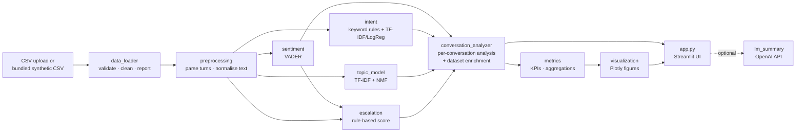

# Architecture

Chatbot Analyzer is a single-process Streamlit application backed by a small,
framework-free Python package (`src/`). All analysis runs locally in memory;
there is no database, server-side state or external service unless the optional
OpenAI summary is switched on.

## Data flow

## Modules

| Module | Responsibility | Depends on |
|---|---|---|
| `data_loader.py` | Read CSV, check required columns, normalise headers, types and booleans, fill or flag missing values, drop empty/duplicate rows, return a `LoadReport` | pandas, `preprocessing` |
| `preprocessing.py` | Parse transcripts into `Turn(role, text)`; normalise and tokenise text; shared stop words and token pattern; detect repeated customer messages | scikit-learn stop-word list |
| `sentiment.py` | VADER compound score per customer message, aggregated per conversation | vaderSentiment |
| `intent.py` | `RuleBasedIntentClassifier` (keywords) and `MLIntentClassifier` (TF-IDF + logistic regression, with hold-out evaluation and per-prediction term contributions) | scikit-learn |
| `topic_model.py` | TF-IDF + NMF topic model, topic naming, per-conversation keywords, corpus keyword ranking | scikit-learn |
| `escalation.py` | Weighted, explainable escalation signals → Low / Medium / High | `preprocessing`, `sentiment` |
| `conversation_analyzer.py` | Fits dataset-level models once; `analyze()` one transcript; `enrich()` a whole frame with derived columns; resolution and handoff heuristics | all of the above |
| `metrics.py` | KPIs and group-bys; prefers ground-truth columns and labels any fallback as a heuristic | pandas, `topic_model` |
| `visualization.py` | Plotly figure builders with one shared style and palette | plotly |
| `llm_summary.py` | Optional OpenAI summary; disabled unless the package and API key are present | openai (optional) |
| `app.py` | Streamlit pages, filters, caching and layout | everything above |

## Design decisions

- **Explainability first.** Every derived value on screen can be traced back:
  escalation signals list their evidence, ML intent predictions list the terms that
  contributed most, topic assignments show the topic's terms, and each result has a
  "How is this calculated?" note.
- **Ground truth beats estimates.** If the CSV includes `resolved` / `escalated`,
  KPIs use them. Heuristic estimates are used only as a fallback, and the KPI card
  says which source it used.
- **Customer messages only** for sentiment and escalation signals. Bot replies are
  scripted to be polite and would bias sentiment; excluding bot/agent text also
  stops the escalation score from simply detecting that a transfer already happened.
- **Train on what is loaded.** The ML intent model and the topic model are fitted at
  start-up on the loaded file (cached per file and settings by
  `st.cache_resource`). There are no pre-trained model artefacts to version or ship.
- **NMF over K-Means for topics.** On short support messages, K-Means on TF-IDF
  vectors put most conversations into one catch-all cluster; NMF gave balanced,
  readable topics.
- **Plain modules, no framework.** `src/` has no Streamlit imports, so it can be
  tested with pytest and reused from a notebook or batch job.

## Testing

`pytest` covers loading and missing-value handling, metric calculations, parsing,
sentiment, both intent classifiers, topic modelling, escalation scoring, the
resolution/handoff heuristics, end-to-end enrichment, and a headless render of
every Streamlit page using `streamlit.testing.v1.AppTest`.

## What a production version would add

This repository is a prototype. A production system would need, at minimum: a
database or warehouse source instead of CSV, incremental processing, a labelled
evaluation set of real conversations, model and data-drift monitoring, access
control, PII redaction before any text is stored or sent to an LLM, and
calibration of the escalation weights against real outcomes.
